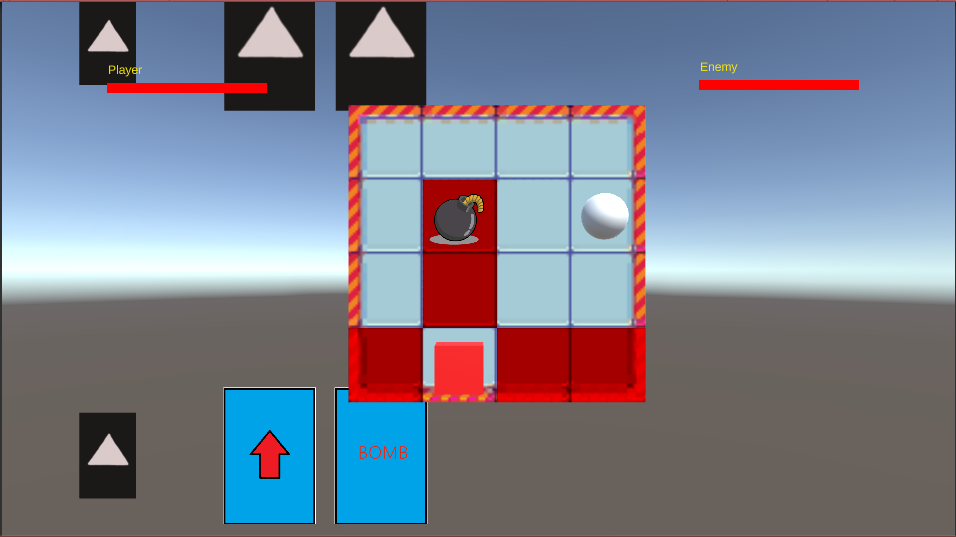
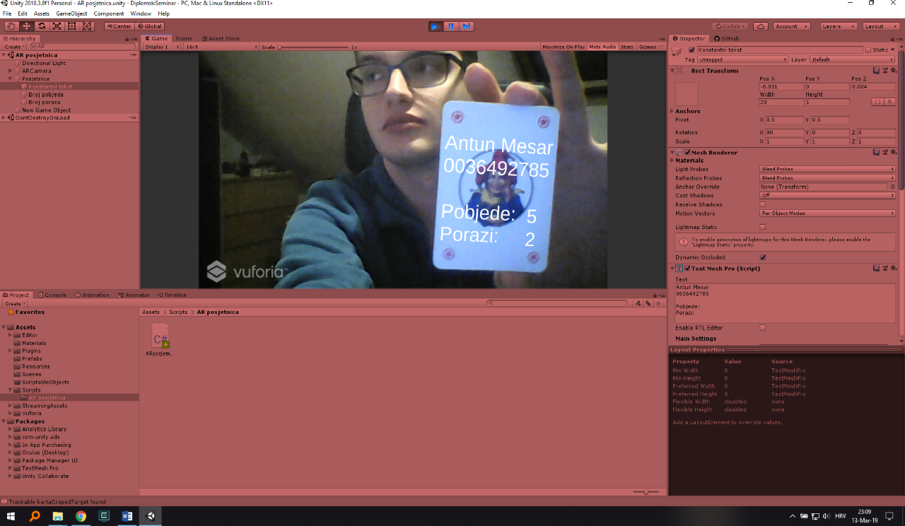

# DiplomskiSeminar
Kartaška igra u kojoj kartama manipulirate vaš položaj na 2d ploči i pokušavate nanijeti štetu protivniku postavljanjem bombi. Karte se stavljaju u red i tek nakon što ste vi i protivnik odigrali 3 karte se one izvrše.
Cilj je povezati iskaznicu u proširenoj stvarnosti sa igrom tako da povečali investiciju igrača prema igri.

Screenshoot iz igre trenutno s programmer artom. Igrač je crvena kocka, a protivnik bijela sfera. Na polju vidimo našu bombu i djevovanje upravo odigrane karte pucanja.

Osnovna iskaznica koja pokazuje ime, prezime, broj pobjeda i broj poraza u igri.
